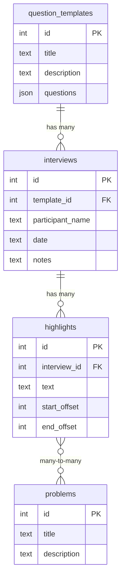

# CLRA — User Research API

A backend API for managing user research: question templates (research plans), interviews, highlights, and problems.

## Data Model

## API Endpoints

### Question Templates (Research Plans)
| Method | Path | Description |
|--------|------|-------------|
| GET | `/api/templates` | List all templates |
| GET | `/api/templates/:id` | Get a template |
| POST | `/api/templates` | Create a template |
| PUT | `/api/templates/:id` | Update a template |
| DELETE | `/api/templates/:id` | Delete a template |

**POST/PUT body:** `{ title, description?, questions? }`  
`questions` is an array of strings.

### Interviews
| Method | Path | Description |
|--------|------|-------------|
| GET | `/api/interviews` | List all (or filter `?template_id=`) |
| GET | `/api/interviews/:id` | Get interview + highlights |
| POST | `/api/interviews` | Create an interview |
| PUT | `/api/interviews/:id` | Update an interview |
| DELETE | `/api/interviews/:id` | Delete (cascades highlights) |

**POST body:** `{ template_id, participant_name, date?, notes? }`

### Highlights
| Method | Path | Description |
|--------|------|-------------|
| GET | `/api/highlights?interview_id=` | List highlights for an interview |
| GET | `/api/highlights/:id` | Get highlight + linked problems |
| POST | `/api/highlights` | Create a highlight |
| DELETE | `/api/highlights/:id` | Delete a highlight |

**POST body:** `{ interview_id, text, start_offset?, end_offset? }`

### Problems
| Method | Path | Description |
|--------|------|-------------|
| GET | `/api/problems` | List all problems |
| GET | `/api/problems/:id` | Get problem + linked highlights |
| POST | `/api/problems` | Create a problem |
| PUT | `/api/problems/:id` | Update a problem |
| DELETE | `/api/problems/:id` | Delete a problem |

**POST body:** `{ title, description? }`

### Highlight ↔ Problem Links
| Method | Path | Description |
|--------|------|-------------|
| POST | `/api/highlights/:id/problems` | Link a problem to a highlight |
| DELETE | `/api/highlights/:id/problems/:problemId` | Unlink |

**POST body:** `{ problem_id }`
